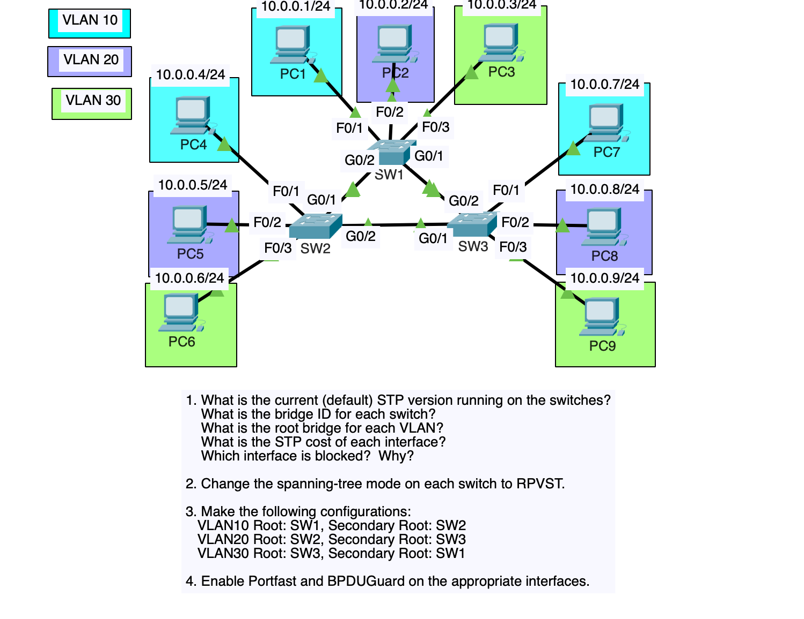

# cisco_SpanningTreeProtocol

This lab Demonstrates the Configuration of Spanning Tree Protocol 

Network Diagram 

Check default version of Spanning Tree Protocol currently running on switches using the "Sh spanning-tree sum" command in Cisco CLI
Identify the Bridge ID for each switch using the "sh span" command in Cisco CLI
Identify the Root Bridge for each Vlan 
Identify the STP cost of each interface  
Change the STP mode on each switch to RPVST using the "spanning-tree mode rapid-pvst" command 
Make configurations to switches in VLANS 10,20,30 
Enable Portfast and BPDUGaurd on certain interfaces connected to end devices using "spanning-tree portfast, span bpdugaurd enable" command in Cisco CLI in global configuration or interface configuration mode. 
